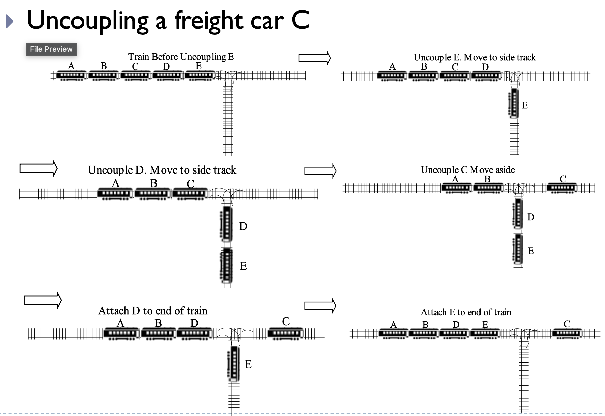

# Stack

```
void pop();
```

remove item from the top of the stack.
precondition

```
T& top(); //LHS modify
```
return a reference to the value item at the top of the stack

Precondition: the stack is not empty

## Stack Object

```
#include <stack>
...
stack<int> s;
int i;
for(i=1; i<=5; i++) //insert 1, 2, 3, 4, 5
    s.push(i);

cout << "Stack size = " << s.size() << endl;
cout << "Popping the stack" << endl;

while(!s.empty())
{
    cout << s.top() << " ";
    s.pop();
}
cout << endl;
```

## Uncoupling Stack Elements

Uncoupling a freight car C



Need two stacks, main stack and side stack

| main stack |
| --- |
| E |
| D |
| C |
| B |
| A |

For D and E
```
sides.push(mains.top())
mains.pop()
```

For C
```
mains.pop()
```

Move D and E back to main
```
mains.push(sides.top())
sides.pop()
```

```
template <typename T>

bool uncouple(stack<T>& s, const T& target)
{
    stack<T> tmpStk;
    bool foundTarget = true;

    while(!s.empty() && (s.top() != target))
    {
        tmpkStk.push(s.top());
        s.pop();
    }

    if (!s.empty())
        s.pop();
    else
        foundTarget = false;
    
    while (!tmpStk.empty())
    {
        s.push(tmpStk.top);
        tmpStk.pop();
    }

    return foundTarget;
}
```

## Summary

- Stack: storage structure with insert (push) and erase (pop) operations occur at one end, called the top of the stack
- The last element in is the first element out of the stack, so a stack is a LIFO structure
- The system maintans a stack of activation records that specify
    1. function arguments (values)
    2. local variables (values)
    3. return address

The system generates & pushes an activation record when calling a function and pop it when returning. This maintains the execution order of the program.

ex:

```
main()
{
    f1(3);
    ...
    f2(4);
}
```

| system stack | 
| --- |
| |
| | 
| ff1 |
| f1, 3, return addr |
| main |

Recursion relies heavily on the system stack to keep track of which functions are called when.

ex:

factorial(4) = 4 * factorial(3) = 4 * 3 * factorial(2) = ...

scoping rule. 

| stack |
| --- |
| f1 |
| 2 * f1 |
| 3 * f2 |
| 4 * f3 |
| f4 |